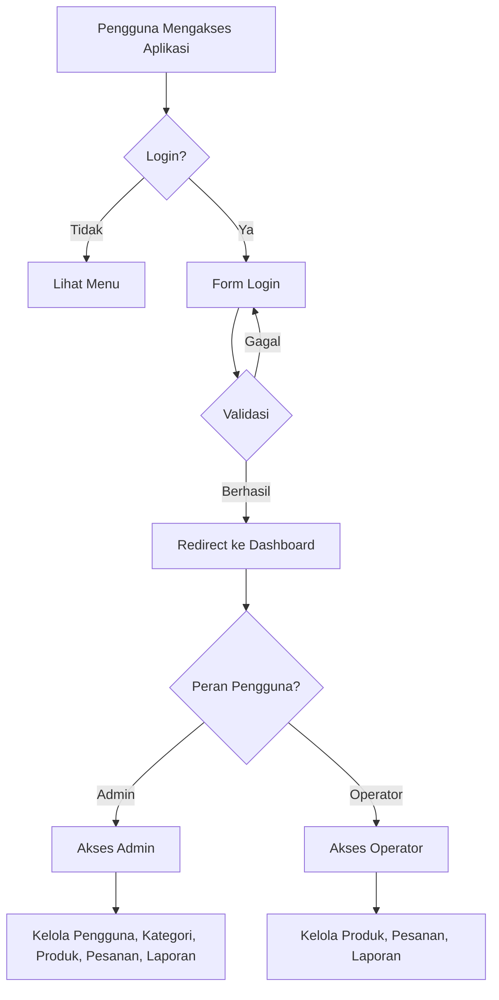
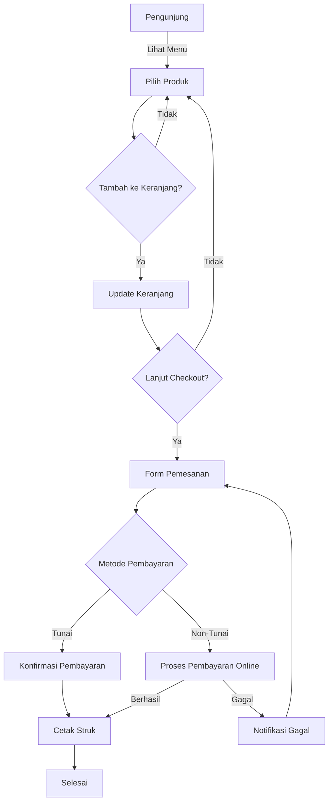
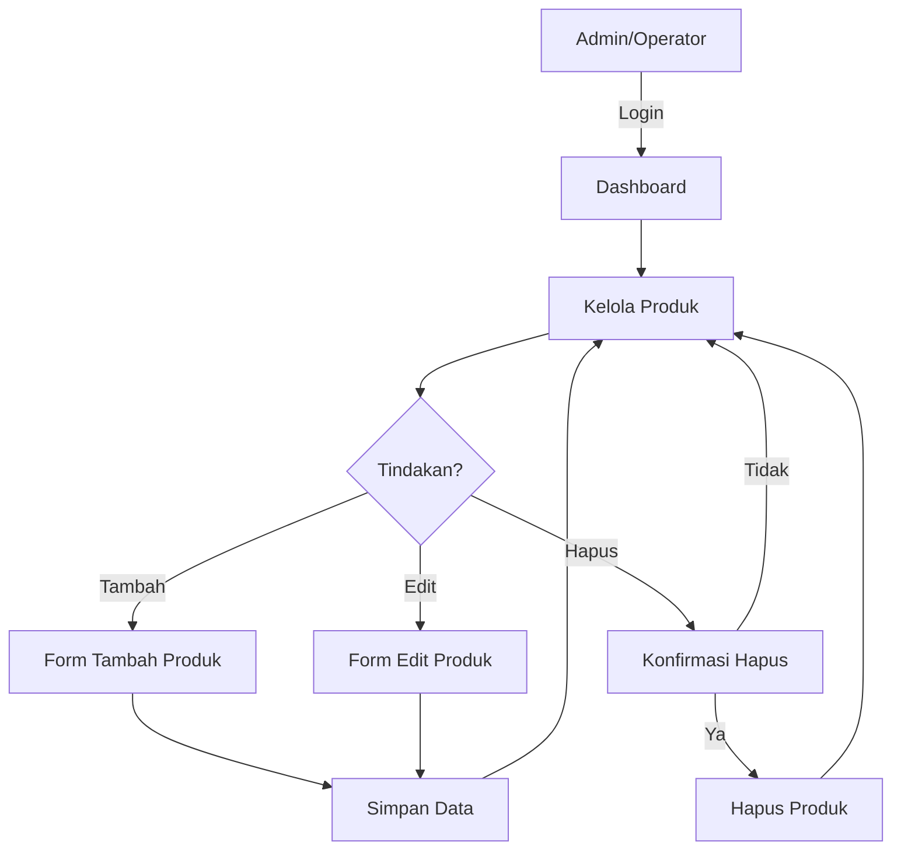
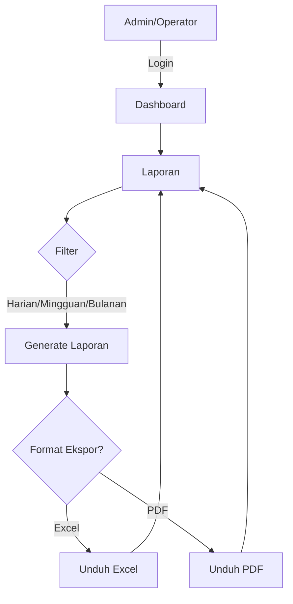
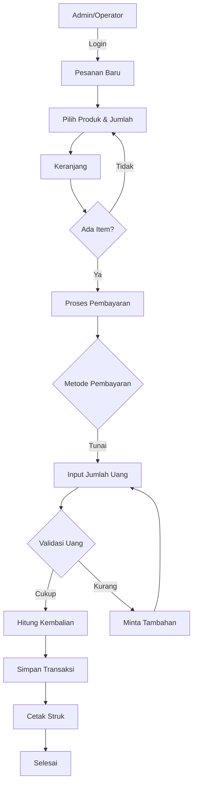

# Flowchart Aplikasi Warung Kopi Otomatis

## 1. Flowchart Autentikasi Pengguna

## 2. Flowchart Proses Pemesanan

## 3. Flowchart Manajemen Produk

## 4. Flowchart Laporan

## 5. Flowchart Proses Pembayaran Tunai

## Cara Menggunakan

1. Salin kode mermaid di atas
2. Tempelkan di file markdown yang mendukung rendering mermaid
3. Atau gunakan editor mermaid online seperti [Mermaid Live Editor](https://mermaid.live/)

## Catatan

- Pastikan ekstensi mermaid terpasang di aplikasi markdown viewer Anda
- Beberapa fitur mungkin memerlukan konfigurasi tambahan tergantung environment Anda
